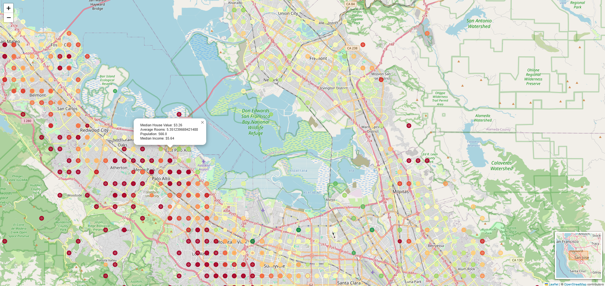

# Overview

This project visualizes the California housing dataset using Python libraries such as Folium and Matplotlib. The visualization includes interactive map markers representing various housing attributes across different locations in California.

## Code Explanation

### Importing Libraries

```python
import pandas as pd
import matplotlib.pyplot as plt
import matplotlib.colors as mcolors

from sklearn.datasets import fetch_california_housing

import folium
from folium import plugins
```

We start by importing the necessary libraries:

Pandas: for handling data manipulation and analysis.
Matplotlib and Matplotlib.colors: for creating visualizations and managing color mappings.
Scikit-learn: to fetch the California housing dataset.
Folium: to create interactive maps.

### Fetching and Preparing Data

```python
data = fetch_california_housing(as_frame=True).frame
```

We use fetch_california_housing from Scikit-learn to load the dataset into a Pandas DataFrame.

### Creating the Map

```python
m = folium.Map(location=[data['Latitude'].mean(), data['Longitude'].mean()], zoom_start=6)
```

A Folium map is initialized centered on the mean latitude and longitude of the data points.

### Adding markers

```python
price_min, price_max = data['MedHouseVal'].min(), data['MedHouseVal'].max()
size_min, size_max = data['AveRooms'].min(), data['AveRooms'].max()

for _, row in data.iterrows():
    normalized_price = (row['MedHouseVal'] - price_min) / (price_max - price_min)
    color = plt.cm.RdYlGn(1 - normalized_price)  # gradient

    normalized_rooms = (row['AveRooms'] - size_min) / (size_max - size_min)

    popup_info = f"""Median House Value: ${row['MedHouseVal']:.2f}<br>
                     Average Rooms: {row['AveRooms']}<br>
                     Population: {row['Population']}<br>
                     Median Income: ${row['MedInc']:.2f}"""

    folium.CircleMarker(
        location=[row['Latitude'], row['Longitude']],
        radius=normalized_rooms * 20 + 5,  # 5 <= radius <= 25
        color=mcolors.to_hex(color[:3]),
        fill=True,
        fill_color=mcolors.to_hex(color[:3]),
        fill_opacity=0.7,
        popup=folium.Popup(popup_info, max_width=300)
    ).add_to(m)
```

We iterate over the data to add circle markers to the map, representing different housing attributes. The marker color and size are dynamically calculated based on the median house value and average number of rooms.

#



### Adding a miniMap and Saving

```python
plugins.MiniMap().add_to(m)

m.save('california_housing.html')
```

The map is saved to an HTML file, which can be viewed in any web browser.
