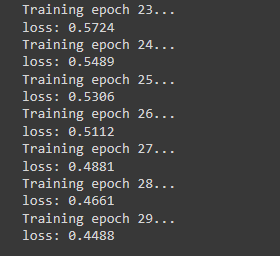
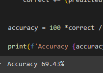

# Overview

This project demonstrates how to build a basic image classifier using PyTorch, utilizing the CIFAR-10 dataset. The neural network is trained to classify images into one of ten classes.

## Code Explanation

### Importing Libraries

```python
import numpy as np
from PIL import Image

import torch
import torch.nn as nn
import torch.nn.functional as F
import torch.optim as optim

import torchvision
import torchvision.transforms as transforms

```

We start by importing the necessary libraries:

NumPy and PIL are used for handling data and images.

- **PyTorch libraries** (torch, torch.nn, torch.optim): are essential for building and training the neural network.
- **Torchvision libraries**: helps in loading and transforming the CIFAR-10 dataset.

### Data Loading and Transformation

```python
transform = transforms.Compose([ transforms.ToTensor(), transforms.Normalize((0.5, 0.5, 0.5), (0.5, 0.5, 0.5)) ])

train_data = torchvision.datasets.CIFAR10(root='./data', train=True, transform=transform, download=True) test_data = torchvision.datasets.CIFAR10(root='./data', train=False, transform=transform, download=True)

train_loader = torch.utils.data.DataLoader(train_data, batch_size=32, shuffle=True, num_workers=2) test_loader = torch.utils.data.DataLoader(test_data, batch_size=32, shuffle=True, num_workers=2)
```

- **Transform**: Converts images to tensors and normalizes them to have a mean of 0.5 and a standard deviation of 0.5.
- **CIFAR-10 Dataset**: Loaded and transformed. The dataset is divided into training and testing sets.
- **DataLoader**: Provides an iterator over the dataset with batching and shuffling for training and testing.

### Visualizing an Image

```python
image, label = train_data[0]

image.size()
```

Retrieves and displays the size of a sample image from the training dataset.

### Defining the Neural Network

```python
class NeuralNet(nn.Module):

def init(self): super().init()

self.conv1 = nn.Conv2d(3, 12, 5) # (32 - 5) / 1 + 1 (12, 28, 28)
self.pool = nn.MaxPool2d(2, 2) # (12, 14, 14)
self.conv2 = nn.Conv2d(12, 24, 5)
self.fc1 = nn.Linear(24 _ 5 _ 5, 120)
self.fc2 = nn.Linear(120, 84)
self.fc3 = nn.Linear(84, 10)

def forward(self, x):
    x = self.pool(F.relu(self.conv1(x)))
    x = self.pool(F.relu(self.conv2(x)))
    x = torch.flatten(x, 1)
    x = F.relu(self.fc1(x))
    x = F.relu(self.fc2(x))
    x = self.fc3(x)
    return x

```

- **NeuralNet Class**: Defines a convolutional neural network with two convolutional layers followed by three fully connected layers.
  - **Convolutional Layers**: Extract features from images.
  - **Pooling Layer**: Reduces the dimensionality of the feature maps.
  - **Fully Connected Layers**: Perform the final classification.

### Training the Model

```python
net = NeuralNet()
loss_function = nn.CrossEntropyLoss()
optimizer = optim.SGD(net.parameters(), lr=0.001, momentum=0.9)

for epoch in range(30):
print(f'Training epoch {epoch}...')

running_loss = 0.0

for i, data in enumerate(train_loader):
inputs, labels = data

    optimizer.zero_grad()

    outputs = net(inputs)

    loss = loss_function(outputs, labels)
    loss.backward()
    optimizer.step()

    running_loss += loss.item()

print(f'loss: {running_loss/len(train_loader):.4f}')
```

- **Network Initialization**: Creates an instance of the neural network, sets up the loss function (CrossEntropyLoss), and defines the optimizer (SGD).
- **Training Loop**: Runs for 30 epochs, calculates loss, and updates the network weights. As we can see in the next image the loss keeps decreasing which indicates that there's room for improvement in the model by increasing the number of epochs.

###



### Saving and Loading the Model

```python torch.save(net.state_dict(), 'trained_net.pth')

net = NeuralNet() net.load_state_dict(torch.load('trained_net.pth'))

```

- **Saving**: The trained model's state is saved to a file.
- **Loading**: The model is reinitialized and loaded with the saved weights.

### Evaluating the Model

```python
correct = 0
total = 0

net.eval()

with torch.no*grad():
for data in test_loader:
images, labels = data
outputs = net(images)
*, predicted = torch.max(outputs, 1)
total += labels.size(0)
correct += (predicted == labels).sum().item()

accuracy = 100 \* correct / total

print(f'Accuracy {accuracy}%')
```

The model's accuracy is computed on the test set without updating the weights.

###



### Using the Model for Predictions

```python
new_transform = transforms.Compose([ transforms.Resize((32, 32)), transforms.ToTensor(), transforms.Normalize((0.5, 0.5, 0.5), (0.5, 0.5, 0.5)) ])

def load_image(image_path): image = Image.open(image_path) image = new_transform(image) image = image.unsqueeze(0) return image

image_paths = ['example1.jpg', 'example2.jpg'] images = [load_image(img) for img in image_paths]

net.eval() with torch.no*grad(): for image in images: output = net(image) *, predicted = torch.max(output, 1) print(f'Prediction: {class_names[predicted.item()]}')
```

Then if we wanted to test the model with data outside of the dataset we could do something like this:

- **Image Transformation**: Resizes and normalizes new images for prediction.
- **Prediction**: Loads images, performs predictions, and prints the results.
