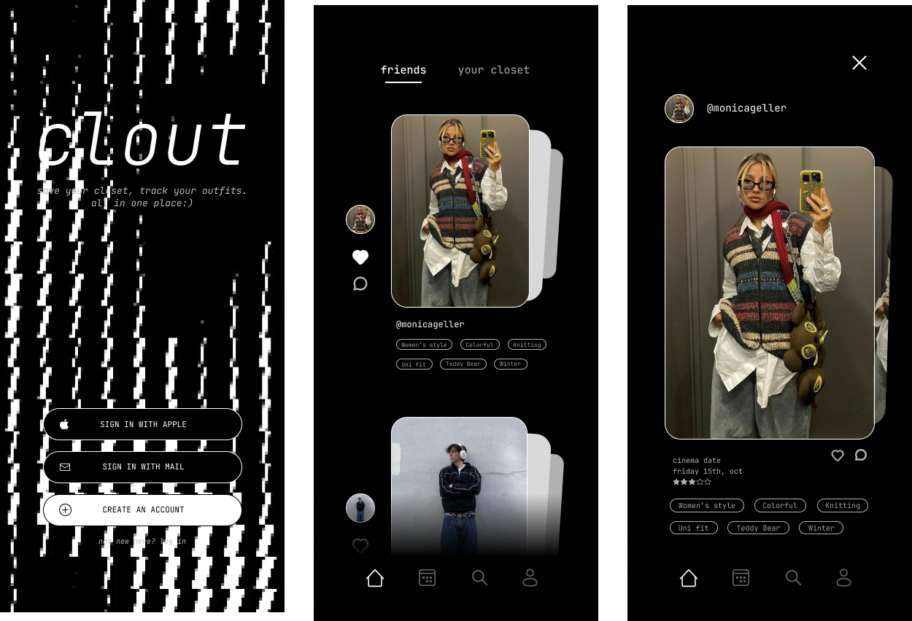
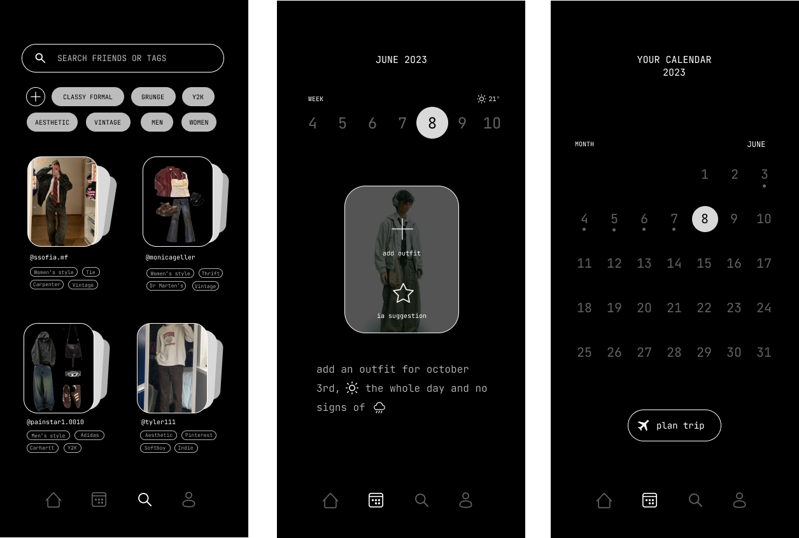
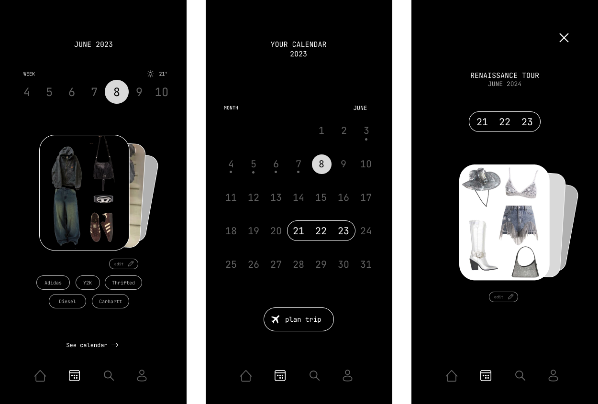
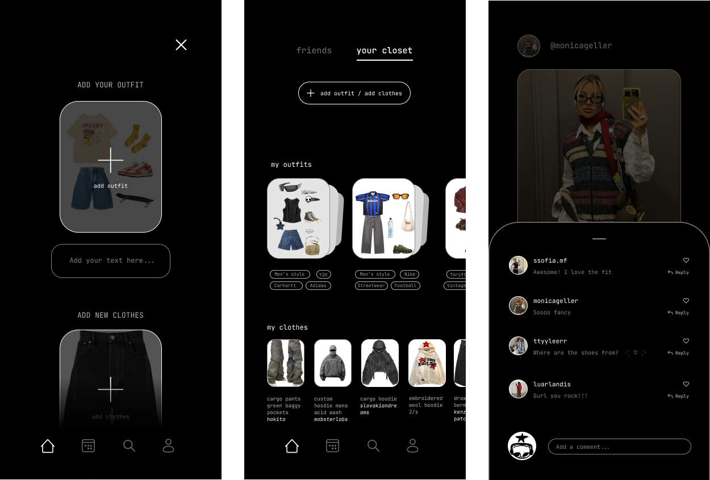
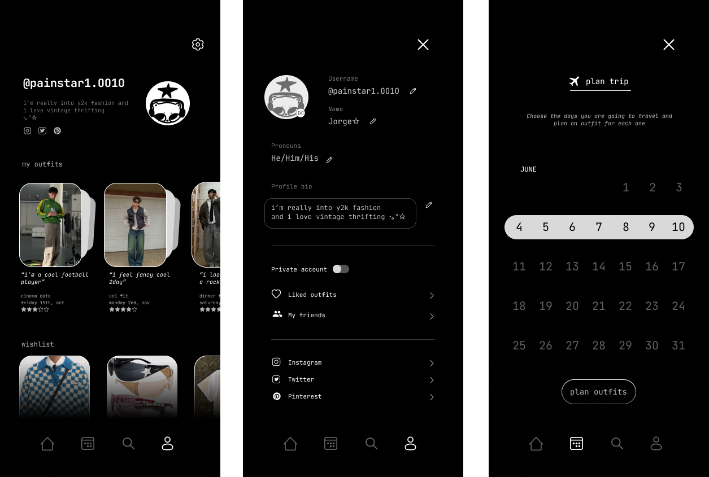
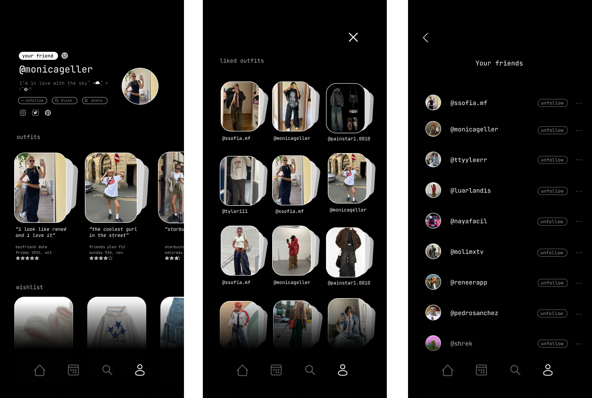
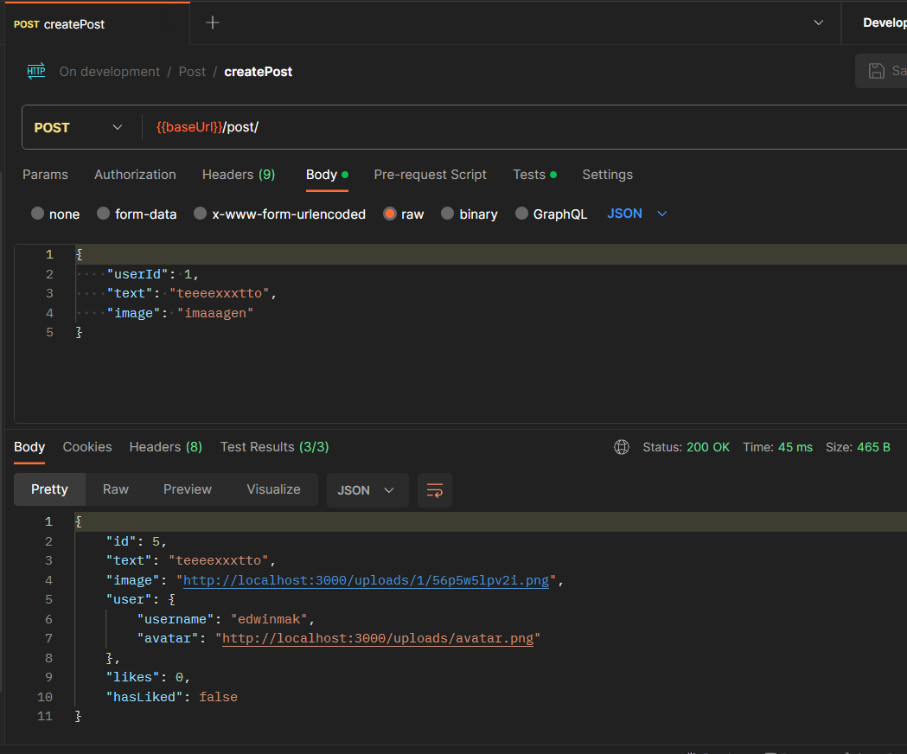
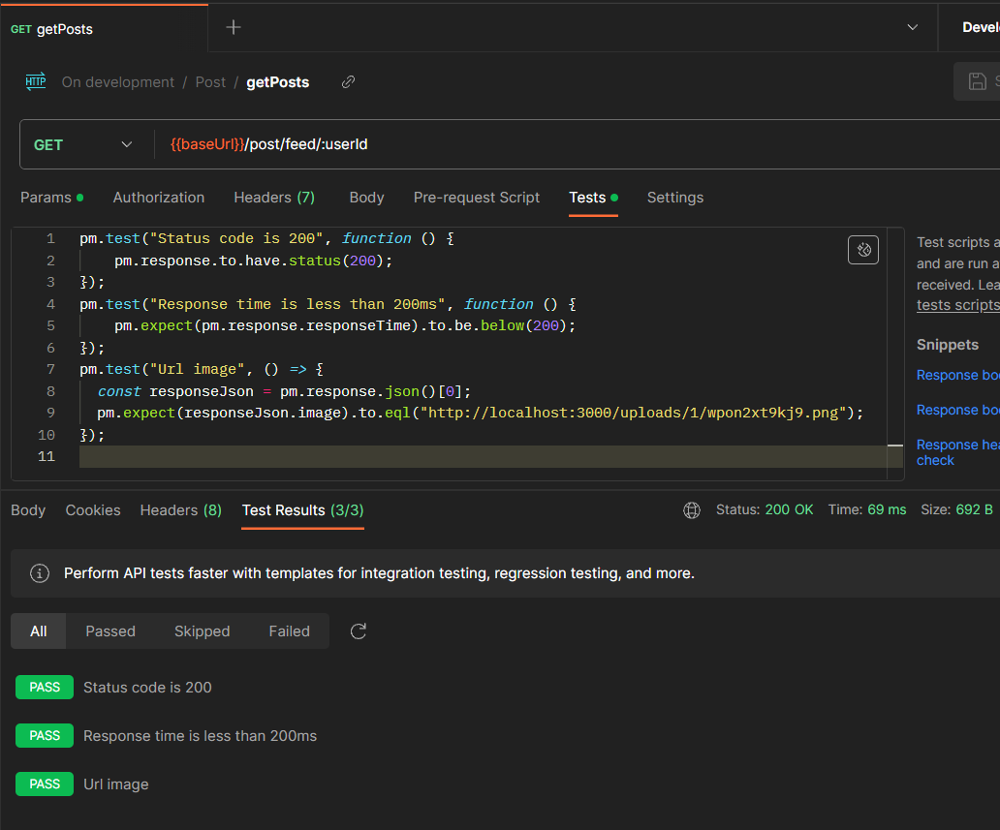
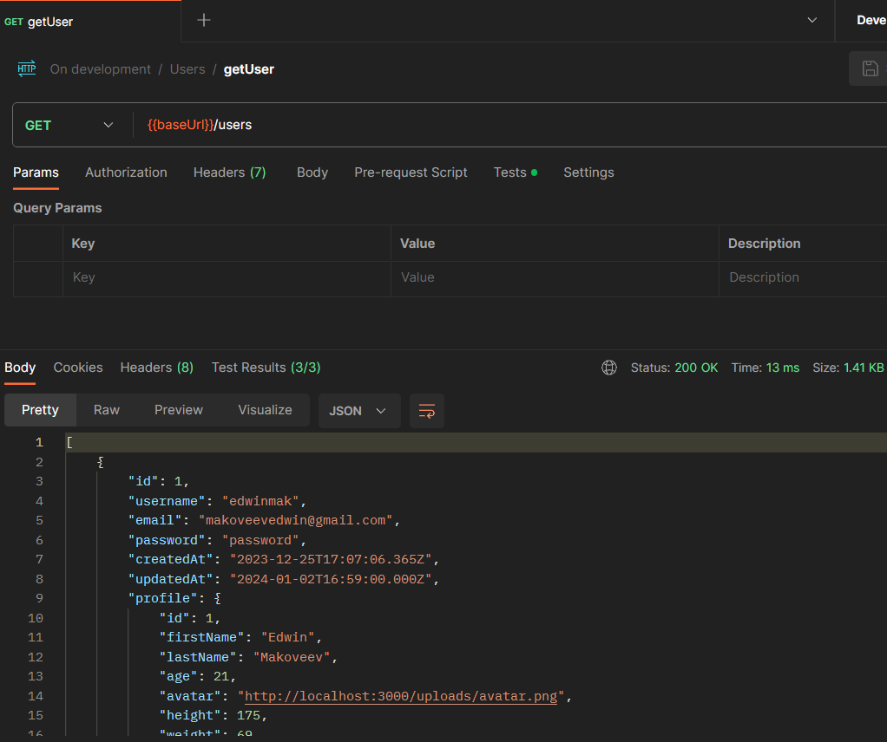

# Overview of the project

This was a collaborative project alongside the Arts Faculty who provided our team with the figma design for the app. Here is a video of a couple of tests we ran with Cypress:

 
<iframe
  width="560"
  height="315"
  src="https://www.youtube.com/embed/jx9mc_nC--g?si=yinGAOPHzhy3VuNe"
  title="Clout"
  allow="accelerometer; autoplay; clipboard-write; encrypted-media; gyroscope; picture-in-picture; web-share"
  referrerpolicy="strict-origin-when-cross-origin"
  allowFullScreen
></iframe>
 

# Development

## Backend

After all the requirements and timeframes were laid out we started setting up the backend with the database.

Tech stack:

- Node.js and Express for the backend.
- MySQL for the db.
- Postman for testing the post/get requests.

This approach enabled us to start the development phase before the design team gave us the final product.

## Frontend

Built using HTML5 and Typescript within the Angular framework, the different screens consist of:

## Frontend

Built using HTML5 and Typescript within the Angular framework, the different screens consist of:

### 1. Register/login and landing page

### 2. Search and calendar functionality

### 3. Add outfits and post functionality

### 4. Others' and personal profile

### 5. Liked posts and following

## Testing

Here are some of the tests written for the endpoints:

###

###

