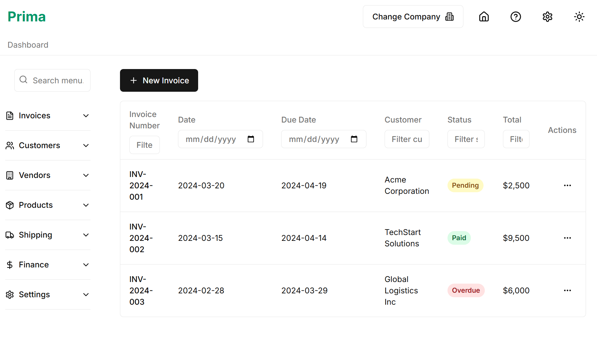
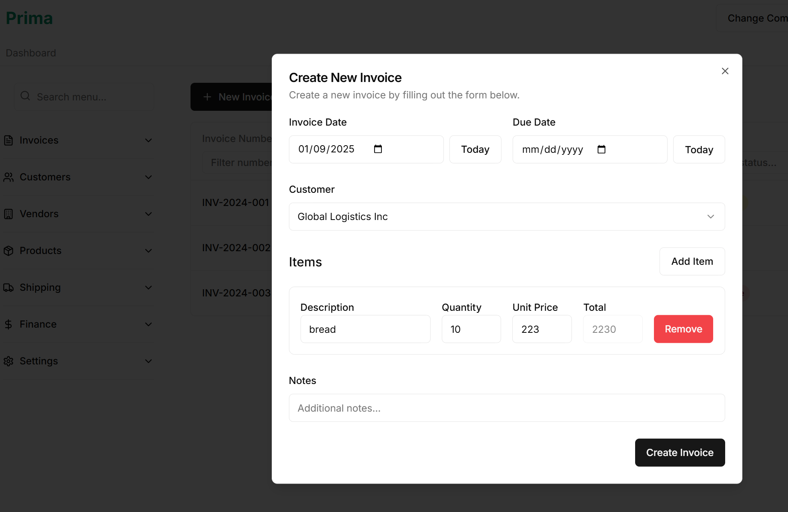
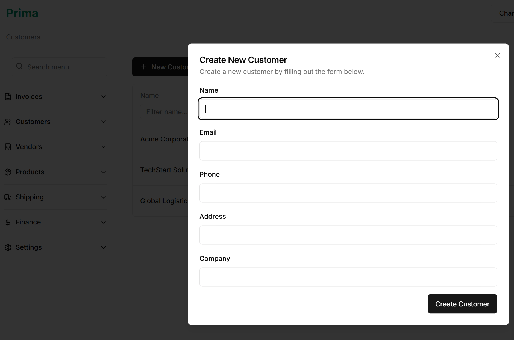
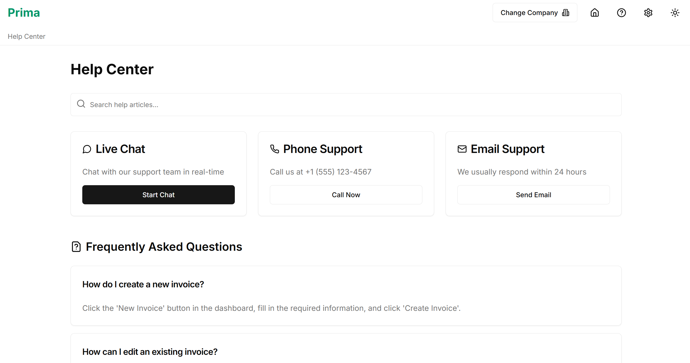

# Overview of the Project

I was tasked with providing a first draft built with react to replace the frontend for an existing ERP used by the company.

 
<iframe
  width="560"
  height="315"
  src="https://www.youtube.com/embed/nfFv2o0JQtM?si=70CqbvA7KFo8AO2i"
  title="test-ecomm"
  allow="accelerometer; autoplay; clipboard-write; encrypted-media; gyroscope; picture-in-picture; web-share"
  referrerPolicy="strict-origin-when-cross-origin"
  allowFullScreen
></iframe>
 

# Development

## Architecture

The project is built using Next.js 13 with the App Router, featuring:

- TypeScript for type safety
- Tailwind CSS for styling
- shadcn/ui for UI components
- Local storage for data persistence (Supabase integration planned)

## Key Features

### 1. Invoice Management

The invoice system includes:
- Real time filtering by each column
- Create and edit invoices
- Status tracking (Draft, Pending, Paid, Overdue)
- Advanced filtering
- Item management with automatic calculations
- Customer association

### 2. Customer Management

Customer features include:
- Real time filtering by each column
- Comprehensive customer database
- Contact information management
- Company details
- Associated invoices
- Quick actions menu

### 3. Help Center

The help center provides:
- Searchable FAQ section
- Multiple support channels
- Live chat integration
- Documentation access
- Contact options

### 4. Theme Support

The application includes:
- Light/Dark mode toggle
- System preference detection
- Consistent styling across themes
- Smooth transitions

## Future Roadmap

Planned features include:
- Authentication system
- Connection with existing backend
- Role-based access control
- Analytics dashboard
- Export functionality
- Email notifications
- Supabase integration
- API documentation
- Mobile app
