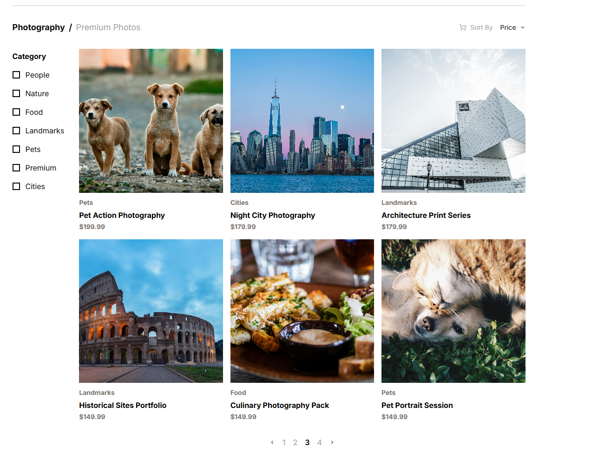
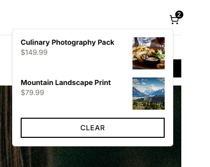
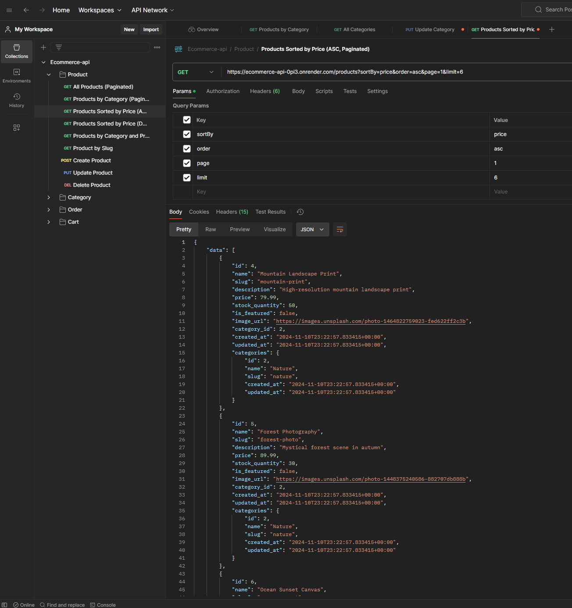

# Overview of the Project

This project was developed as a technical assessment to create a full-stack e-commerce platform. The implementation was based on a provided Figma design, focusing on pixel-perfect recreation and responsive behavior:
https://www.figma.com/design/8GMqmwf47zlFgvLUWxqmL4/Bokokode-Frontend-Test-(Copy)?node-id=0-1&t=vkMVJ0v5WG99VtWc-1.

 
<iframe
  width="560"
  height="315"
  src="https://www.youtube.com/embed/DZrTJcGbs7g?si=BF_ps0XW9OfFz43t"
  title="test-ecomm"
  allow="accelerometer; autoplay; clipboard-write; encrypted-media; gyroscope; picture-in-picture; web-share"
  referrerPolicy="strict-origin-when-cross-origin"
  allowFullScreen
></iframe>
 

# Development

## Backend Architecture

The backend was built using NestJS with TypeScript, following a clean architecture pattern with:

- Controllers for handling HTTP requests
- Services for business logic
- Models for type definitions
- Supabase integration for database operations

Tech stack:

- NestJS for the API
- Supabase for the database
- TypeScript for type safety
- Postman for API testing

## Frontend Implementation

Built with Next.js and TypeScript, the frontend features:

### 1. Landing Page with Featured Product

The landing page showcases:
- Featured product with 3 related items
- Pagination (6 products per page)
- Category filtering
- Price sorting (ascending/descending)

### 2. Product Grid and Hover Effects

Product cards include:
- Dynamic hover effects
- Add to cart button on hover
- Responsive grid layout
- Price and category information

### 3. Shopping Cart Popup

Cart features:
- Floating cart window
- Product quantity adjustment
- Total price calculation
- Clear items functionality

### 4. Mobile Responsive Design

The application is fully responsive with:
- Mobile-optimized layouts
- Touch-friendly interactions
- Adaptive navigation
- Responsive images

## Testing

The project includes comprehensive API testing via Postman:

### API Testing Collection

The provided `api-calls.json` includes endpoints for:
- Product management
- Category operations
- Cart functionality
- Order processing

### Database Schema

The `init.sql` file contains:
- Table definitions
- Relationships
- Sample data
- Indexes for optimization

Example of product retrieval test:

## Key Features

1. **Product Management**
   - Pagination with 6 items per page
   - Featured product with related items
   - Category filtering
   - Price sorting

2. **Shopping Experience**
   - Interactive cart popup
   - Real-time price updates
   - Quantity management
   - Responsive design

3. **Database Design**
   - Optimized queries
   - Proper indexing
   - Referential integrity
   - Sample data population
